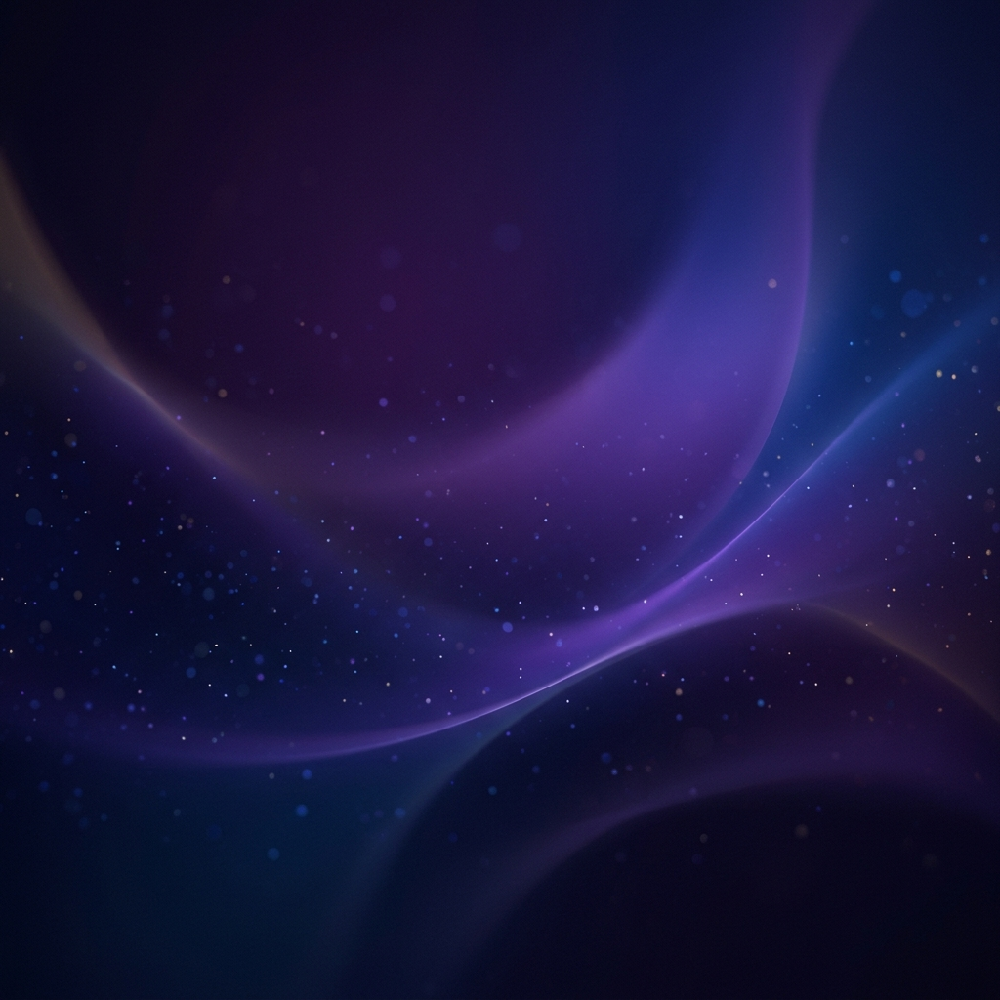

# FocusFlow | 極致質感蕃茄鐘

FocusFlow 是一款結合 **Glassmorphism (玻璃擬態)** 美學與高效生產力邏輯的網頁應用程式。它不僅僅是一個番茄鐘，更是一個能幫助您進入深度工作狀態的精緻工具。

## ✨ 核心特色

- **玻璃擬態視覺 (Glassmorphism)**：使用毛玻璃效果與流光背景，提供極致奢華的視覺體驗。
- **智能自動循環**：內建經典番茄鐘邏輯：
  - 專注周期 (Focus): 40 分鐘
  - 短暫休息 (Short Break): 5 分鐘
  - 長時間休息 (Long Break): 每兩個專注周期後提供 10 分鐘大休息
- **整合式待辦清單**：內建 Google Tasks 風格的任務管理，支援任務新增、編輯、刪除。
- **資料持久化**：所有設定與任務清單皆自動儲存於瀏覽器 `LocalStorage`，重新整理也不遺失。
- **響應式佈局**：完美適配桌面顯示器與各種行動裝置螢幕。

## 🛠️ 技術棧

- **Core**: HTML5, Vanilla JavaScript (ES6+)
- **Styling**: Vanilla CSS3 (Custom Glassmorphism tokens)
- **Icons**: [Lucide Icons](https://lucide.dev/)
- **Typography**: [Google Fonts - Outfit](https://fonts.google.com/specimen/Outfit)

## 🚀 快速啟動

1. 克隆或下載此儲存庫。
2. 在任意現代瀏覽器中開啟 `index.html`。
3. 開始您的專注旅程！

## 部署與使用

您可以將此儲存庫上傳至 GitHub 並啟用 **GitHub Pages**，即可擁有您專屬的線上番茄計時站。

---

## 👥 開發資訊

- **協作開發**: Anita Lo & [Antigravity](https://github.com/google-deepmind)
- **建立日期**: 2026-04-09
- **最新更新**: 2026-04-10

*Made with ❤️ for productivity.*
